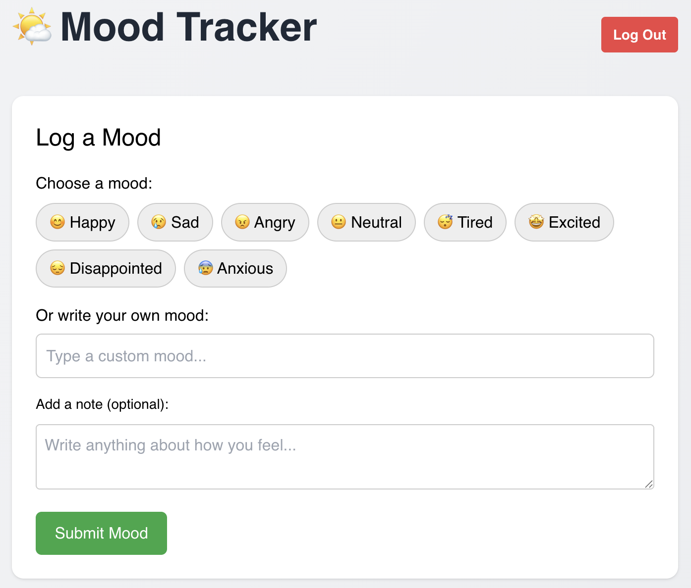
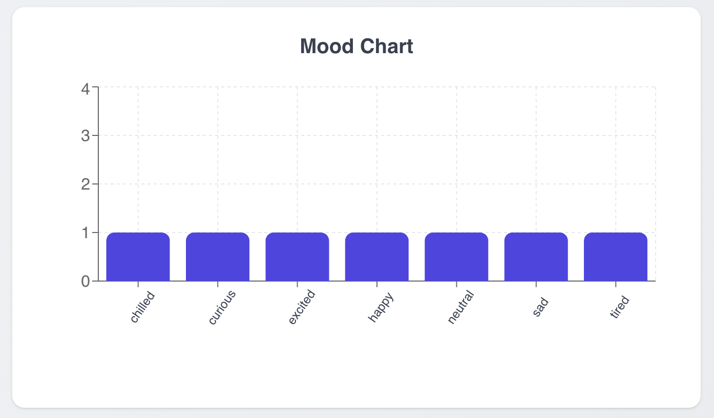
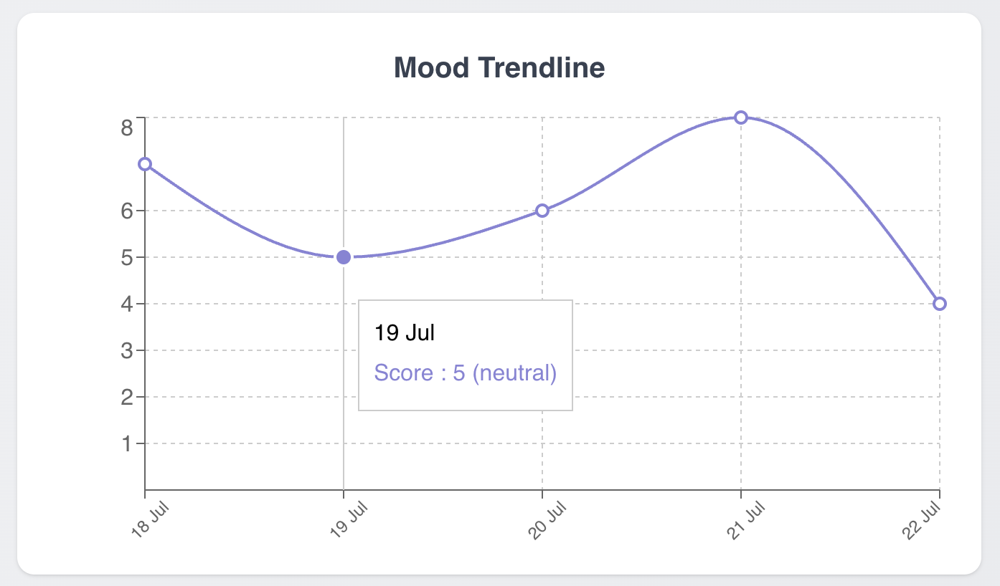
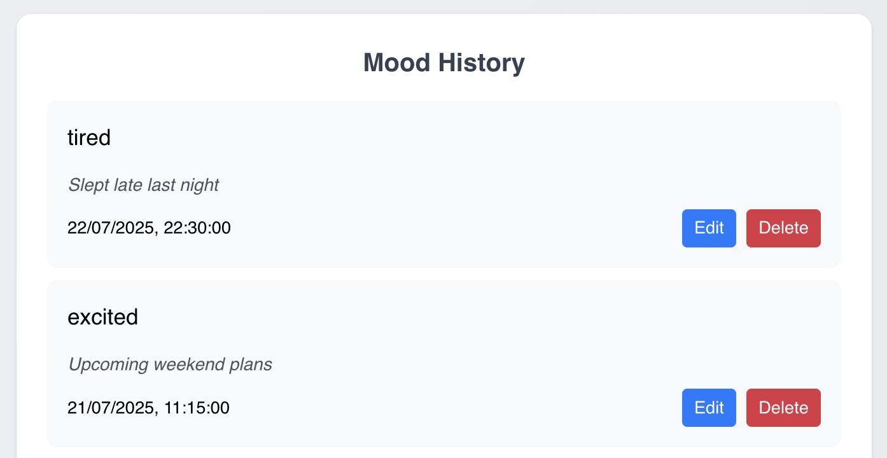
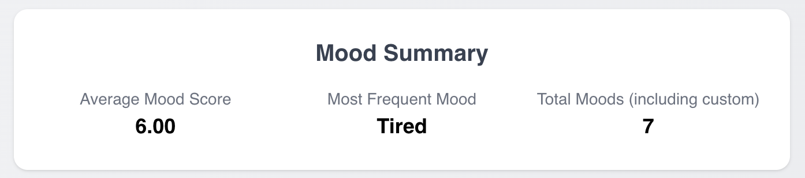
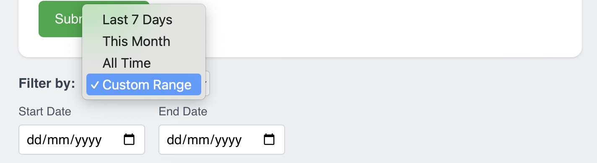
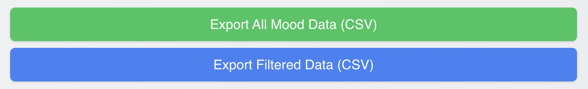

# 🧠 Wellness Tracker

A full-stack **mood and wellness tracking app** where users can log moods, filter by date ranges, visualize emotional trends, and export their data as CSV files.

This project showcases **frontend (React + Tailwind)**, **backend (Flask + SQLAlchemy)**, and **database (PostgreSQL)** skills, along with **data analytics features**, **charting**, and **full deployment to the cloud**.

---

## 🌐 Live Demo

- **Frontend:** [https://wellness-tracker-app.netlify.app/](https://wellness-tracker-app.netlify.app/)
- **Backend API:** [https://wellness-tracker-a0qm.onrender.com/](https://wellness-tracker-a0qm.onrender.com/)  
  *(Note: The backend API itself is not meant for direct browsing; it powers the frontend with endpoints for logging moods, analytics, and CSV exports.)*

---

## ⚙️ Tech Stack

**Frontend**
- React (Create React App)
- Tailwind CSS
- Recharts (for mood trends)
- Axios (API requests)

**Backend**
- Python Flask (REST API)
- Flask SQLAlchemy + Flask-Migrate
- PostgreSQL (hosted on Neon)
- CORS + Environment-based config

**Deployment**
- **Netlify** for the React frontend
- **Render** for Flask backend (API)
- **Neon** for PostgreSQL database
- **GitHub** for version control

---

## 📦 Features

- **Mood Logging:** Predefined moods (emoji labels) + custom mood input.
- **Analytics:**  
  - Mood summary card (average mood score, most frequent mood, total logs).
  - Interactive mood trend chart with responsive design.
- **Date Filters:** Last 7 days, This Month, All Time, or Custom Range.
- **CSV Export:** Download all data or only filtered mood entries.
- **Mobile Friendly:** Fully responsive UI for desktop & mobile.
- **Full-Stack Workflow:** Integrated backend API with database.

---

## 📊 Screenshots

### Mood Form


### Mood Chart


### Data Trendline 


### Data History 


### Data Summary 


### Filter Data Option 


### CSV Export 


---

## 🔧 Local Setup

Clone the repo and run locally:

```bash
git clone https://github.com/KizMistry/wellness-tracker.git
cd wellness-tracker
```
### Frontend:
```
cd frontend
npm install
npm start
```
### Backend:
```
cd backend
python3 -m venv venv
source venv/bin/activate
pip install -r requirements.txt
```
### Set up your .env file:
```
DATABASE_URL=your_postgres_url_here
```
### Run migrations and start the backend:
```
flask db upgrade
flask run
```
## 🧠 Why I Built This
This project demonstrates:

- End-to-end full-stack development (React → Flask → PostgreSQL).

- Data handling and analytics with visual charts.

- A production-ready, fully deployed app.

I wanted to create a project that’s practical, visually engaging, and shows my ability to combine frontend interactivity with backend logic and database management.

## 👨‍💻 About Me
I’m a junior developer with a background in finance, now focusing on frontend, full-stack, and data-centric roles.

This project reflects my ability to take an idea from concept to live product using modern technologies, while prioritizing usability and real-world application.

Connect with me: https://www.linkedin.com/in/kiran-mistry-software-developer/
